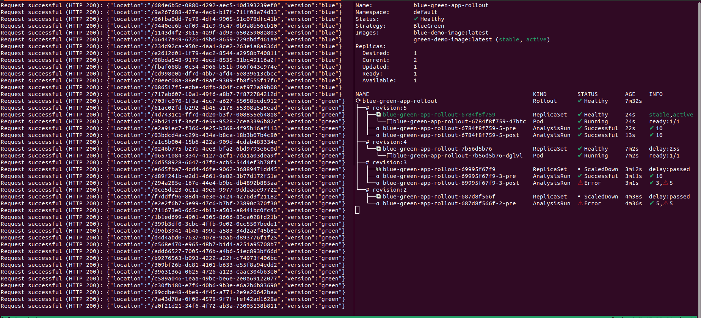

# Blue-Green demo

The idea is to showcase a local blue-green deployment.

The demo sets up a local Kubernetes cluster using Kind and configures it with Ingress-Nginx for routing. It includes an Argo Rollout to demonstrate blue-green deployment strategies. The demo features scripts like 'simulate-requests' to mimic incoming traffic and 'switch-image' to dynamically switch between blue and green versions of an application. Additionally, the 'make status' command provides a live overview of the deployment's behavior during image transitions.

### Install dependencies

This demo is developed on Ubuntu 22 but is designed to be compatible with various Linux distributions and macOS, assuming the necessary dependencies are installed.

**dependencies:**
- docker
- kind
- kubectl
- kubectl-argo-rollouts
- **uuidgen** (this tool will be needed only if OS is not linux)

For Ubuntu distributions, you can use make install_deps to automatically install these dependencies.

```
$ make install_deps
Checking and installing required packages...
Docker is already installed
Kind is already installed
kubectl is already installed
Argo Rollouts plugin is already installed
```

If you're using a Linux distribution other than Ubuntu or macOS, refer to the official documentation to install the necessary tools:

- Docker: Follow the Docker installation guide for your distribution [here](https://docs.docker.com/engine/install/)
- Kind: Refer to the Kind documentation for installation instructions on different platforms [here](https://kind.sigs.k8s.io/docs/user/quick-start/).
- kubectl: Install kubectl using the instructions provided [here](https://kubernetes.io/docs/reference/kubectl/)
- kubectl-argo-rollouts: For installation, consult the Argo Rollouts GitHub repository [here](https://github.com/argoproj/argo-rollouts#installation)

### Run the demo

These steps outline how to execute the blue-green deployment demo, showcasing image switching and monitoring using simulated requests. Use terminal splitting tools like tmux or separate terminal tabs to streamline the demo process and monitor the deployment progress effectively.

#### Step 1: Prepare the demo

Run the following command to set up the demo environment, including bootstrapping the kind cluster and deploying all necessary components:
```
make prepare_demo
```

This process may take a minute or two to complete. Meanwhile, you can monitor the progress of the Argo Rollout using the following command in a separate terminal window:

```
make status
```


#### Step 2: Simulate Requests

Once everything is ready, simulate requests by executing:
```
make requests
```

The output will display the location targeted (a UUID) and the version (indicating blue or green) to which the request is connected

In a different terminal window, execute the following command to monitor the status of the rollout thought the demo
```
make status
```

#### Step 3 (Optional): Toggle Auto Promotion to false

By default, this Argo Rollouts demo is configured with `autoPromotionEnabled` set to true, which automatically promotes rollouts after successful completion of prePromotionAnalysis.

To change this behavior and enable manual promotion using a command later in the demo, you can disable auto promotion by executing the following command:
```
make disable_auto_promotion
```

You can revert this setting at any point by executing:
```
make enable_auto_promotion
```

#### Step 4: Showcase Failure before promotion

In this demonstration, we have configured prePromotionAnalysis and postPromotionAnalysis to assess the health of the service by conducting 10 HTTP requests and validating the presence of a version field. The success or failure of these analyses will determine the criteria for promotion and rollback.

To simulate a scenario where prePromotionAnalysis fails, we will intentionally introduce a failure in our application after a few seconds. Execute the following command to make our application image fail after 5 seconds by setting the FAIL_AFTER_SECONDS environment variable in the Argo Rollout:

```
make fail
```

Use the make status command to monitor the analysis errors until the new version's status is flagged as "Degraded":


The rollout status will appear as "Degraded" after the status is flagged as "Error":


This demonstration showcases how the prePromotionAnalysis can detect issues and prevent automatic promotion, allowing you to observe the impact of failures on the rollout's status and behavior. Adjust the analysis criteria and handling based on your specific deployment requirements and error scenarios

#### Step 5: Showcase Failure After Promotion

In this step, we will simulate a failure occurring after the promotion, allowing the prePromotionAnalysis to pass before encountering errors.

To initiate the rollout failure after the pre-promotion analysis has run successfully, execute the following command:
```
make fail_after_promotion
```

If you have **autoPromotionEnabled** set to false (as described in Step 3), you will need to manually promote the image after the pre-promotion analysis finishes. Use the following command to perform manual promotion:
```
make manual-promotion
```

After approximately 12 seconds, the image will begin to return HTTP error 500 responses. This occurs after the pre-promotion analysis has been successfully completed and the preview service has been promoted to active. As a result, simulated requests will start to fail, triggering the post-promotion analysis to detect failures.


The image will begin to return HTTP error 500 responses before the post-promotion analysis is completed. Once the post-promotion analysis is flagged as an error, the active service will be rolled back to the previous working rollout version. As a result, the simulated requests will start to show successes again once the rollback is complete.


#### Step 6: Restore Health

To restore the health of our rollout, we will remove the FAIL_AFTER_SECONDS environment variable from our configuration.

Execute the following command to recover the healthiness of the rollout:
```
make healthy
```

#### Step 7: Showcase Successful Rollout

To demonstrate a successful case, change the rollout image by executing the following command:
```
make switch
````

This command initiates the rollout process and provides updates on the progress of the image version change. You can reuse the make switch command to continuously switch images and monitor the rollout's evolution.


If you are running this demo with **autoPromotionEnabled** set to false, the rollout will be paused after the pre-promotion analysis succeeds. At this point, you will need to execute `make manual-promotion` to continue.


Once the post-promotion analysis is complete, the rollout will be flagged as stable



#### Step 8: Clean Up

Once you have completed the demo, use the following command to bring down the kind cluster and delete all associated resources:

```
make delete_cluster
```

This will clean up the environment and remove all deployed components.
